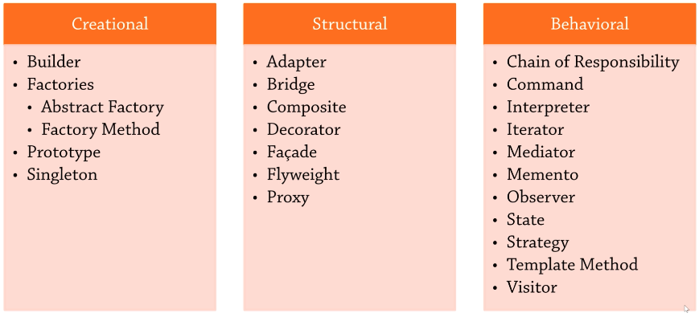

# Introduction

- Design patterns are common architectural approaches
- Popularized by the Gang of Four book (1994)
- Universally relevant

## The Patterns

<p>

</p>

# Single Responsibility Principle

```jsx
const fs = require('fs')

class Journal {
  constructor() {
    this.entries = {}
  }

  addEntry(text) {
    let c = ++Journal.count
    let entry = `${c}: ${text}`
    this.entries[c] = entry
    return c
  }

  removeEntry(index) {
    delete this.entries[index]
  }

  toString() {
    return Object.values(this.entries).join('\n')
  }

  // save(filename)
  // {
  //   fs.writeFileSync(filename, this.toString());
  // }
  //
  // load(filename)
  // {
  //   //
  // }
  //
  // loadFromUrl(url)
  // {
  //   //
  // }
}
Journal.count = 0

class PersistenceManager {
  preprocess(j) {
    //
  }

  saveToFile(journal, filename) {
    fs.writeFileSync(filename, journal.toString())
  }
}

let j = new Journal()
j.addEntry('I cried today.')
j.addEntry('I ate a bug.')
console.log(j.toString())

let p = new PersistenceManager()
let filename = 'c:/temp/journal.txt'
p.saveToFile(j, filename)

// separation of concerns
```

# Open-Closed Principle

- Open for extension, closed for modification

```jsx
let Color = Object.freeze({
  red: 'red',
  green: 'green',
  blue: 'blue',
})

let Size = Object.freeze({
  small: 'small',
  medium: 'medium',
  large: 'large',
  yuge: 'yuge',
})

class Product {
  constructor(name, color, size) {
    this.name = name
    this.color = color
    this.size = size
  }
}

class ProductFilter {
  filterByColor(products, color) {
    return products.filter((p) => p.color === color)
  }

  filterBySize(products, size) {
    return products.filter((p) => p.size === size)
  }

  filterBySizeAndColor(products, size, color) {
    return products.filter((p) => p.size === size && p.color === color)
  }

  // state space explosion
  // 3 criteria (+weight) = 7 methods

  // OCP = open for extension, closed for modification
}

let apple = new Product('Apple', Color.green, Size.small)
let tree = new Product('Tree', Color.green, Size.large)
let house = new Product('House', Color.blue, Size.large)

let products = [apple, tree, house]

// let pf = new ProductFilter();
// console.log(`Green products (old):`);
// for (let p of pf.filterByColor(products, Color.green))
//   console.log(` * ${p.name} is green`);

// ↑↑↑ BEFORE

// ↓↓↓ AFTER

// general interface for a specification
class ColorSpecification {
  constructor(color) {
    this.color = color
  }

  isSatisfied(item) {
    return item.color === this.color
  }
}

class SizeSpecification {
  constructor(size) {
    this.size = size
  }

  isSatisfied(item) {
    return item.size === this.size
  }
}

class BetterFilter {
  filter(items, spec) {
    return items.filter((x) => spec.isSatisfied(x))
  }
}

// specification combinator
class AndSpecification {
  constructor(...specs) {
    this.specs = specs
  }

  isSatisfied(item) {
    return this.specs.every((x) => x.isSatisfied(item))
  }
}

let bf = new BetterFilter()
console.log(`Green products (new):`)
for (let p of bf.filter(products, new ColorSpecification(Color.green))) {
  console.log(` * ${p.name} is green`)
}

console.log(`Large products:`)
for (let p of bf.filter(products, new SizeSpecification(Size.large))) {
  console.log(` * ${p.name} is large`)
}

console.log(`Large and green products:`)
let spec = new AndSpecification(
  new ColorSpecification(Color.green),
  new SizeSpecification(Size.large)
)
for (let p of bf.filter(products, spec)) console.log(` * ${p.name} is large and green`)
```

# Liskov Substitution Principle

```jsx
class Rectangle {
  constructor(width, height) {
    this._width = width
    this._height = height
  }

  get width() {
    return this._width
  }
  get height() {
    return this._height
  }

  set width(value) {
    this._width = value
  }
  set height(value) {
    this._height = value
  }

  get area() {
    return this._width * this._height
  }

  toString() {
    return `${this._width}×${this._height}`
  }
}

class Square extends Rectangle {
  constructor(size) {
    super(size, size)
  }

  set width(value) {
    this._width = this._height = value
  }

  set height(value) {
    this._width = this._height = value
  }
}

let useIt = function (rc) {
  let width = rc._width
  rc.height = 10
  console.log(`Expected area of ${10 * width}, ` + `got ${rc.area}`)
}

let rc = new Rectangle(2, 3)
useIt(rc)

let sq = new Square(5)
useIt(sq)
```

# Interface Segregation Principle

```jsx
var aggregation = (baseClass, ...mixins) => {
  class base extends baseClass {
    constructor(...args) {
      super(...args)
      mixins.forEach((mixin) => {
        copyProps(this, new mixin())
      })
    }
  }
  let copyProps = (target, source) => {
    // this function copies all properties and symbols, filtering out some special ones
    Object.getOwnPropertyNames(source)
      .concat(Object.getOwnPropertySymbols(source))
      .forEach((prop) => {
        if (
          !prop.match(
            /^(?:constructor|prototype|arguments|caller|name|bind|call|apply|toString|length)$/
          )
        )
          Object.defineProperty(target, prop, Object.getOwnPropertyDescriptor(source, prop))
      })
  }
  mixins.forEach((mixin) => {
    // outside constructor() to allow aggregation(A,B,C).staticFunction() to be called etc.
    copyProps(base.prototype, mixin.prototype)
    copyProps(base, mixin)
  })
  return base
}

class Document {}

class Machine {
  constructor() {
    if (this.constructor.name === 'Machine') throw new Error('Machine is abstract!')
  }

  print(doc) {}
  fax(doc) {}
  scan(doc) {}
}

class MultiFunctionPrinter extends Machine {
  print(doc) {
    //
  }

  fax(doc) {
    //
  }

  scan(doc) {
    //
  }
}

class NotImplementedError extends Error {
  constructor(name) {
    let msg = `${name} is not implemented!`
    super(msg)
    // maintain proper stack trace
    if (Error.captureStackTrace) Error.captureStackTrace(this, NotImplementedError)
    // your custom stuff here :)
  }
}

class OldFashionedPrinter extends Machine {
  print(doc) {
    // ok
  }

  // omitting this is the same as no-op impl

  // fax(doc) {
  //   // do nothing
  // }

  scan(doc) {
    // throw new Error('not implemented!');
    throw new NotImplementedError('OldFashionedPrinter.scan')
  }
}

// solution
class Printer {
  constructor() {
    if (this.constructor.name === 'Printer') throw new Error('Printer is abstract!')
  }

  print() {}
}

class Scanner {
  constructor() {
    if (this.constructor.name === 'Scanner') throw new Error('Scanner is abstract!')
  }

  scan() {}
}

class Photocopier extends aggregation(Printer, Scanner) {
  print() {
    // IDE won't help you here
  }

  scan() {
    //
  }
}

// we don't allow this!
// let m = new Machine();

let printer = new OldFashionedPrinter()
printer.fax() // nothing happens
//printer.scan();
```

# Dependency Inversion

```jsx
let Relationship = Object.freeze({
  parent: 0,
  child: 1,
  sibling: 2,
})

class Person {
  constructor(name) {
    this.name = name
  }
}

// LOW-LEVEL (STORAGE)

class RelationshipBrowser {
  constructor() {
    if (this.constructor.name === 'RelationshipBrowser')
      throw new Error('RelationshipBrowser is abstract!')
  }

  findAllChildrenOf(name) {}
}

class Relationships extends RelationshipBrowser {
  constructor() {
    super()
    this.data = []
  }

  addParentAndChild(parent, child) {
    this.data.push({
      from: parent,
      type: Relationship.parent,
      to: child,
    })
    this.data.push({
      from: child,
      type: Relationship.child,
      to: parent,
    })
  }

  findAllChildrenOf(name) {
    return this.data
      .filter((r) => r.from.name === name && r.type === Relationship.parent)
      .map((r) => r.to)
  }
}

// HIGH-LEVEL (RESEARCH)

class Research {
  // constructor(relationships)
  // {
  //   // problem: direct dependence ↓↓↓↓ on storage mechanic
  //   let relations = relationships.data;
  //   for (let rel of relations.filter(r =>
  //     r.from.name === 'John' &&
  //     r.type === Relationship.parent
  //   ))
  //   {
  //     console.log(`John has a child named ${rel.to.name}`);
  //   }
  // }

  constructor(browser) {
    for (let p of browser.findAllChildrenOf('John')) {
      console.log(`John has a child named ${p.name}`)
    }
  }
}

let parent = new Person('John')
let child1 = new Person('Chris')
let child2 = new Person('Matt')

// low-level module
let rels = new Relationships()
rels.addParentAndChild(parent, child1)
rels.addParentAndChild(parent, child2)

new Research(rels)
```

# Summary

## Single REsponsibility Principle

- A class should only have one reason to change
- Separartion of concerns - different classess handling different, independent tasks/problems.

## Open-Closed Principle

- Classes should be open for extension but closed for modification.

## Liskov Substitution Principle

- You should be able to substitute a base type for a subtype.

## Interface Segregation Principle

- Don't put too much into an interface; split into separate interfaces
- YAGNI - You Ain't Going to Need It.

## Dependency Inversion Principle

- High-level modules should not depend upon low-level ones; use abstractions.
